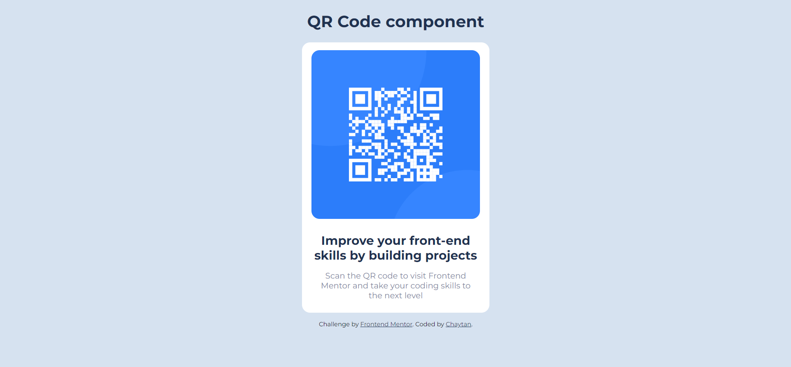

# Frontend Mentor - QR code component

### Screenshot

### Links

- Solution URL: [GitHub repository link](https://github.com/chaytan5/qr-code-component-main)
- Live Site URL: [Live site URL](https://qr-component-chaytan5.netlify.app/)

### Built with

- Semantic HTML5 markup
- CSS3

### This was my first coding challenge by Frontend Mentor.
